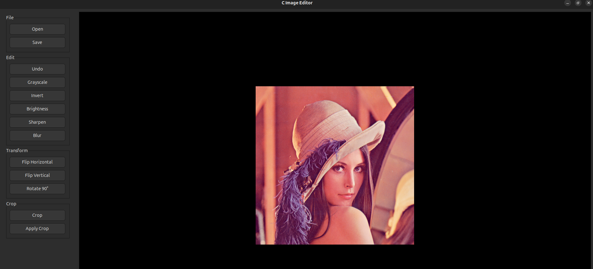
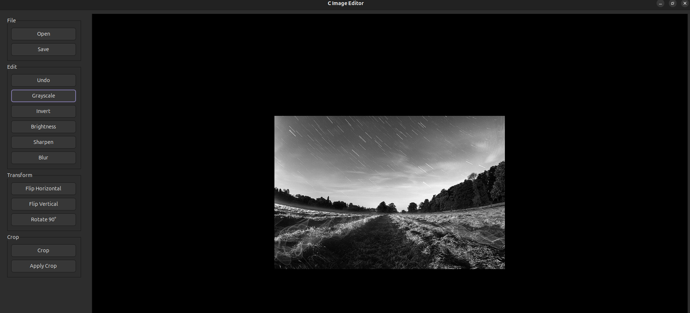
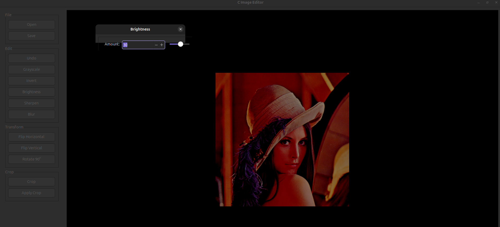
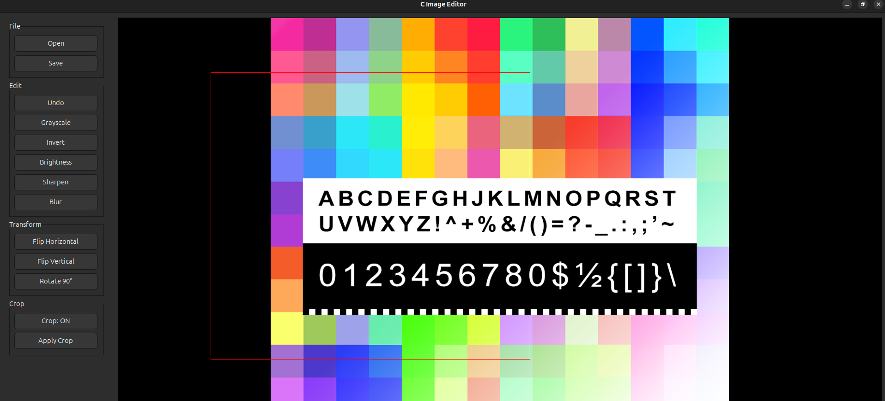

# Image Editor

A desktop image manipulation application written in **C** using the **IUP (Portable User Interface) toolkit**.

This project was developed as a structured programming project to demonstrate the practical use of functions, structures, pointers, arrays, dynamic memory allocation, file handling, and modular programming.

The application works with **24-bit uncompressed BMP images** and provides several image manipulation operations through a graphical user interface.

## Features

- Open 24-bit uncompressed BMP images
- Display images through a graphical interface
- Save edited images as BMP files
- Grayscale conversion
- Brightness adjustment
- Image inversion
- Horizontal flip
- Vertical flip
- 90-degree clockwise rotation
- Image cropping
- 3×3 blur
- 3×3 sharpening
- Multi-step undo
- Error handling for invalid operations and inputs

## Screenshots

### Main Interface



### Grayscale



### Brightness Adjustment



### Crop Tool



## Technologies

- C
- IUP GUI Toolkit
- GCC
- Make
- BMP image format

## Project Structure

```text
image-editor/
├── include/
│   ├── operations/
│   ├── bmp.h
│   ├── gui.h
│   ├── gui_callbacks.h
│   ├── gui_crop.h
│   ├── gui_dialogs.h
│   ├── gui_image.h
│   ├── image.h
│   ├── undo.h
│   └── utils.h
│
├── src/
│   ├── operations/
│   ├── bmp.c
│   ├── gui.c
│   ├── gui_callbacks.c
│   ├── gui_crop.c
│   ├── gui_dialogs.c
│   ├── gui_image.c
│   ├── image.c
│   ├── main.c
│   ├── undo.c
│   └── utils.c
│
├── test_images/
│   └── ...
│
├── screenshots/
│   ├── main.png
│   ├── grayscale.png
│   ├── brightness.png
│   └── crop.png
│
├── .gitignore
├── Makefile
└── README.md
```

The project is organized into separate modules for image management, BMP file handling, GUI functionality, callbacks, dialogs, cropping, undo functionality, utilities, and image-processing operations.

## Image Format

The editor supports:

- 24-bit uncompressed BMP
- `.bmp` input files
- `.bmp` output files

Other image formats such as PNG, JPEG, and GIF are not supported.

## Image Representation

The image is represented in memory using structures and dynamically allocated pixel data.

A pixel contains three color components:

```c
typedef struct {
    unsigned char r;
    unsigned char g;
    unsigned char b;
} Pixel;
```

The image contains information such as its width, height, and dynamically allocated pixel array.

Pixels can then be accessed directly using their coordinates, allowing the image-processing algorithms to manipulate individual RGB values.

## Image Processing Operations

### Grayscale

Converts a color image into grayscale using a weighted combination of the RGB channels:

```text
Gray = 0.299R + 0.587G + 0.114B
```

The calculated grayscale value is assigned to all three color channels.

### Brightness

Adjusts the brightness of the image by adding a user-specified value to the RGB components.

The resulting values are restricted to the valid range:

```text
0 to 255
```

### Invert

Creates a negative-like version of the image:

```text
R = 255 - R
G = 255 - G
B = 255 - B
```

### Horizontal Flip

Mirrors the image from left to right by exchanging pixels across the vertical axis.

```text
(x, y) → (width - 1 - x, y)
```

### Vertical Flip

Mirrors the image from top to bottom by exchanging pixels across the horizontal axis.

```text
(x, y) → (x, height - 1 - y)
```

### Rotate 90 Degrees

Rotates the image 90 degrees clockwise.

Since the dimensions change during rotation, a new image is created with the width and height exchanged.

### Crop

Allows the user to select a rectangular region of the image and create a new image containing the selected area.

The crop selection is kept within the image boundaries.

### Blur

Applies a 3×3 averaging filter to the image.

Each output pixel is calculated from the surrounding pixels. A separate image buffer is used during the operation so that newly calculated pixels do not affect subsequent calculations.

### Sharpen

Applies a 3×3 convolution kernel:

```text
 0  -1   0
-1   5  -1
 0  -1   0
```

The kernel emphasizes differences between a pixel and its surrounding pixels, producing a sharper appearance.

## Undo System

The editor includes an undo system that stores previous image states before image-processing operations are applied.

This allows the user to revert changes without having to reopen the original image.

The undo functionality is implemented separately from the GUI and image-processing modules.

## GUI Architecture

The graphical interface is implemented using IUP.

The GUI is separated into several components:

- `gui.c` — main GUI construction and application window
- `gui_callbacks.c` — callbacks for user actions
- `gui_crop.c` — crop interaction
- `gui_dialogs.c` — dialogs used by the application
- `gui_image.c` — image display and GUI image handling

This separation keeps GUI logic independent from the actual image-processing algorithms.

## Image Management

Image creation, copying, and destruction are handled separately from the GUI.

The image management module is responsible for:

- Creating images
- Allocating pixel memory
- Copying images
- Destroying images
- Managing image dimensions
- Managing pixel data

This helps prevent unnecessary duplication of image-management logic throughout the application.

## BMP Handling

BMP loading and saving are implemented in the BMP module.

```text
bmp.c
bmp.h
```

The BMP module handles reading image data from BMP files and writing modified image data back to BMP files.

The image-processing algorithms operate on the application's internal `Image` representation rather than directly manipulating the BMP file.

## Build System

The project uses a `Makefile` for compilation.

The Makefile uses:

```text
GCC
IUP
-Wall
-Wextra
```

It automatically includes C files from:

```text
src/
src/operations/
```

The generated executable is:

```text
image-editor
```

## Requirements

Before compiling, install:

- GCC
- Make
- IUP development libraries

The current Makefile expects IUP to be installed under:

```text
/opt/iup
```

If IUP is installed somewhere else, update the include and library paths in the `Makefile`.

## Compilation

Clone the repository:

```bash
git clone https://github.com/tasib-dev/image-editor.git
cd image-editor
```

Build the project:

```bash
make
```

This creates the executable:

```bash
./image-editor
```

## Running

Run the application using:

```bash
make run
```

or directly:

```bash
./image-editor
```

## Cleaning Build Files

To remove compiled object files and the executable:

```bash
make clean
```

## Typical Workflow

1. Start the application.
2. Open a 24-bit BMP image.
3. Select an image-processing operation.
4. Adjust any required parameters.
5. Apply the operation.
6. Continue editing or use Undo to revert a change.
7. Save the final image as a BMP file.

## Concepts Demonstrated

This project demonstrates practical implementation of:

- Structured programming
- Modular programming
- Functions
- Structures
- Pointers
- Arrays
- Dynamic memory allocation
- File handling
- Binary file processing
- Pixel-level image manipulation
- GUI programming
- Callback functions
- Convolution
- Memory management
- Error handling

## Educational Purpose

The primary purpose of this project is to demonstrate how fundamental C programming concepts can be combined to create a practical graphical application.

Rather than relying on ready-made image-processing functions, the image manipulation operations are implemented using C and direct pixel manipulation.

## Author

**Abdullah Khabbab Tasib**

GitHub: https://github.com/tasib-dev

Repository: https://github.com/tasib-dev/image-editor

## License

This project was developed for educational purposes.
